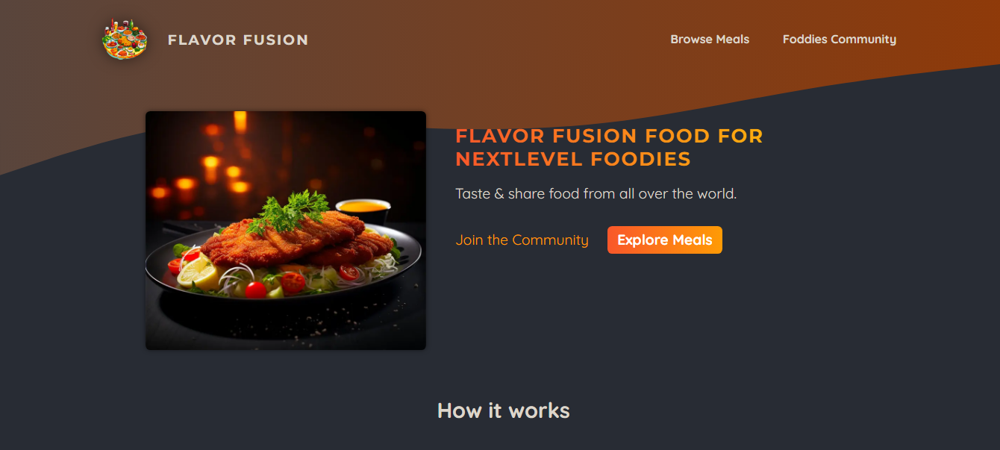
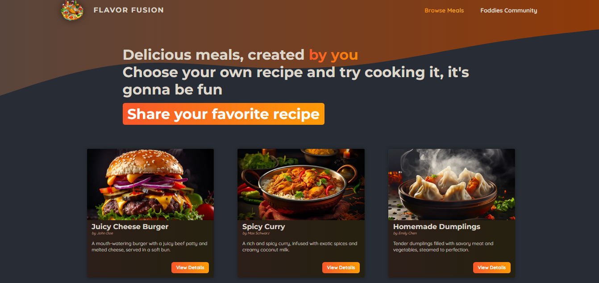
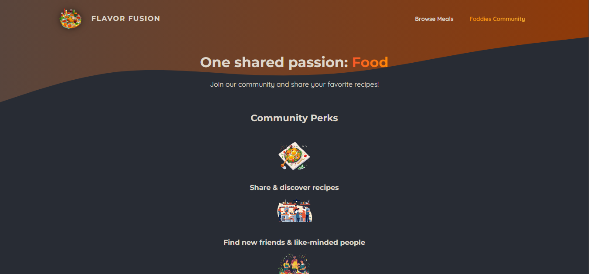
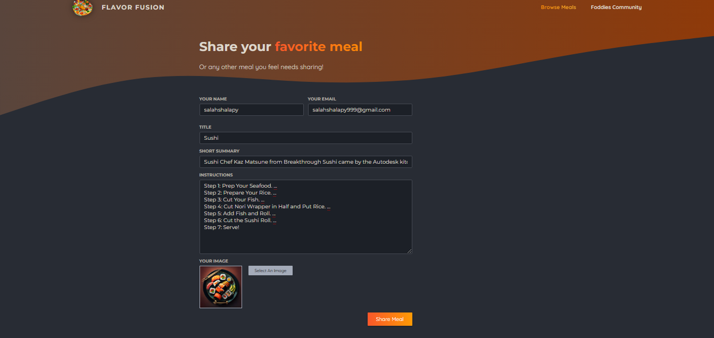
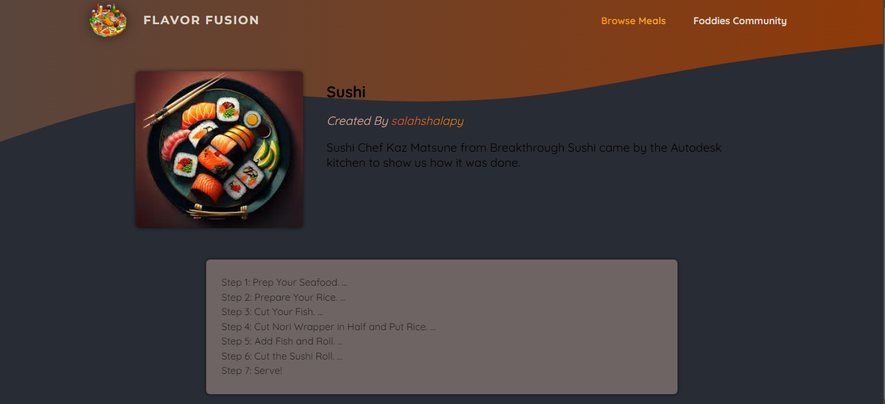

<div id="top"></div>

 <!--  -->


[](https://react.dev/)


<!-- PROJECT LOGO -->
<br />
<div align="center">
  <a href="https://flavor-fusion-flax.vercel.app/">
    
  </a>
  <h1 align="center">Flavor Fusion</h1>

  <p align="center">
    <a href="https://flavor-fusion-flax.vercel.app/">View Demo</a>
    ·
    <a href="https://github.com/SalahShallapy/flavor-fusion/issues">Report Bug</a>
  </p>
</div>

Flavor Fusion Food is a platform where food enthusiasts can share their favorite recipes and connect with like-minded people. Users can browse meals, view detailed recipes, and get inspiration for their next culinary creation.

## Project Overview

### Main Overview



### All Meals Overview



### Community Overview



### Add Meal Overview



### Added Meal and Meal Details Overview



## Features

- **Browse Meals**: Explore a variety of recipes from users around the world.
- **Meal Details**: View detailed recipes with instructions, ingredients, and meal creators.
- **Responsive Design**: Optimized for desktop and mobile devices.
- **Search Functionality**: Easily find meals based on titles, ingredients, or creators.
- **Image Support**: Each meal includes a featured image that can be uploaded by the creator.
- **Meal Submission (Local Environment)**: Add new meals to the platform (details below).

## Project Structure

```
Flavor Fusion
│      .eslintrc.json
│      .gitignore
│      initdb.js
│      jsconfig.json
│      meals.db
│      next.config.js
│      package-lock.json
│      package.json
│      README.md
│
└─── app
│   │    global.css
│   │    icon.png
│   │    layout.js
│   │    not-found.jsx
│   │    page.js
│   │    page.module.css
│   │
│   └─── community
│   │       page.jsx
│   │       page.module.css
│   │
│   └─── meals
│      │    error.jsx
│      │    not-found.jsx
│      │    page.jsx
│      │    page.module.css
│      │
│      └─── [mealSlug]
│      │     page.jsx
│      │     page.module.css
│      │
│      └─── share
│            error.jsx
│            page.jsx
│            page.module.css
│
│
├───assets ------> Alll images's sources
│
│
├───components
│   │
│   └─── images
│   │       images-slideshow.jsx
│   │       image-slideshow.module.css
│   │
│   └─── images
│   │        main-header-background.jsx
│   │        main-header-background.module.css
│   │        main-header.jsx
│   │        main-header.module.css
│   │        nav-link.jsx
│   │        nav-link.module.css
│   │
│   └─── images
│           image-picker.jsx
│           image-picker.module.css
│           meal-item.jsx
│           meal-item.module.css
│           meals-form-submit.jsx
│           meals-grid.css
│           meals-grid.module.jsx
│
├─── lib
│     actions.js
│     meals.js
│
```

## Installation

To get started with the project locally:

1. Clone the repository:
   ```bash
   git clone https://github.com/SalahShallapy/Flavor-Fusion.git
   ```
2. Navigate to the project directory:
   ```bash
   cd Flavor-Fusion
   ```
3. Install dependencies:
   ```bash
   npm install
   ```
4. Run the project:
   ```bash
   npm run dev
   ```

## Adding a New Meal (Functionality)

### Local Version

To add a meal locally:

1. Navigate to the meal submission page.
2. Provide a title, summary, instructions, and an image.
3. The meal data, including the image, will be uploaded to your configured AWS S3 bucket (if correctly set up with valid AWS credentials).
4. The meal will be stored in your local SQLite database.

**Important Notes**:

- You must have valid AWS credentials set in your \`.env\` file for meal image uploads to work.
- If you do not have AWS keys configured, you will get an error while attempting to add a new meal.
- The image is uploaded to an S3 bucket, and a URL to the uploaded image is stored in the database.
- You need to handle image uploads and ensure your S3 bucket permissions are correctly set to allow access.

### Deployed Version (Vercel)

For the deployed version:

- **Meal Addition**: Due to security restrictions and deployment settings on Vercel, the \"Add Meal\" functionality may not work properly unless valid AWS keys and configurations are correctly set in Vercel's environment settings.
- **Permissions**: The S3 bucket and AWS IAM role permissions should be configured to allow public \`GET\` requests for images, but private \`POST\` and \`PUT\` requests for image uploads.

**Important Notes for Deployed Version**:

- Make sure your AWS credentials are securely added to Vercel’s environment variables.
- If the deployed version doesn’t allow adding meals, check the permissions for the S3 bucket and verify your Vercel settings for environmental variables.
- You may also need to troubleshoot any issues related to security policies (CORS, Content Security Policies).

## Notes

- **Content Security Policy (CSP)**: Ensure your deployed environment has the appropriate security headers configured for inline scripts if needed.
- **S3 Bucket Configuration**: If you face issues with image uploads or access, double-check your S3 permissions (you might need to adjust the CORS policy or bucket access settings).
- **SQLite Database**: Locally, the project uses SQLite for storing meal data. On the deployed version, a different database solution may be required (depending on your Vercel setup).
- **Deployment Issues**: Ensure the project is correctly deployed with all environmental variables configured in Vercel for optimal performance.

## Contributing

Contributions are what make the open source community such an amazing place to learn, inspire, and create. Any contributions you make are **greatly appreciated**.

If you have a suggestion that would make this better, please fork the repo and create a pull request. You can also simply open an issue with the tag "enhancement".
Don't forget to give the project a star! Thanks!

1. Fork the Project
2. Create your Feature Branch (`git checkout -b feature/AmazingFeature`)
3. Commit your Changes (`git commit -m 'Add some AmazingFeature'`)
4. Push to the Branch (`git push origin feature/AmazingFeature`)
5. Open a Pull Request

<p align="right">(<a href="#top">back to top</a>)</p>
